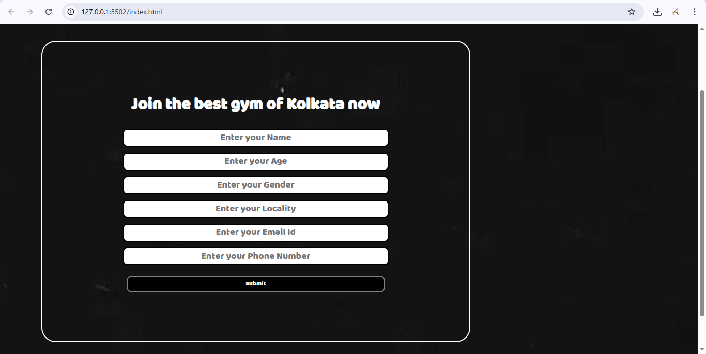

# 🏋️‍♂️ Fitness with Asish

**Fitness with Asish** is a responsive and visually engaging fitness website built using HTML, CSS, and JavaScript. It serves as a landing page or personal trainer portfolio site, aimed at promoting health, fitness programs, and personal training services.

## 🚀 Features

- Responsive design compatible with all devices
- Clean and modern UI
- Sections for Home, About, Services, and Contact
- Smooth scrolling and interactive elements

## 🛠️ Technologies Used

- HTML5
- CSS3
- JavaScript

## 📸 Screenshots

### 🧭 Header


###  Body


## 📂 Folder Structure

Fitness_with_Asish/
├── index.html
├── style.css
├── script.js
├── images/
└── screenshots/

bash
Copy code

## 💡 How to Use

1. Clone the repository:
   ```bash
   git clone https://github.com/Asish7980/Fitness_with_Asish.git
Open index.html in your browser.

🤝 Contributing
Pull requests are welcome. For major changes, please open an issue first to discuss what you'd like to change.

📄 License
This project is licensed under the MIT License.

🔗 Live Preview (Optional)
yaml
Copy code

---

### ✅ Instructions for Screenshots

Place your screenshots at:
Fitness_with_Asish/screenshots/screenshot1.png
Fitness_with_Asish/screenshots/screenshot2.png
